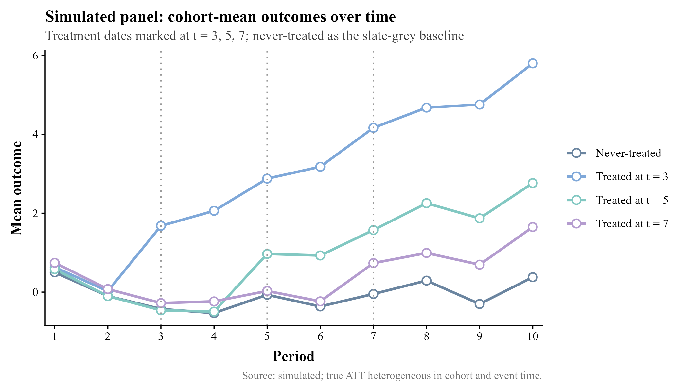

# 面向经管专业的 R 可复现 Codex 工作流

**作者：** 朱 晨 | 遗传社科研究 Chen Zhu | China Agricultural University (CAU)

**最后更新：** 2026-05-12

这是一个为经济学、管理学和社会科学实证研究准备的 R 工作流。核心目标是让一个研究项目从原始数据、清洗、变量构造、模型估计，到表格、图形和 Quarto 报告，都能被稳定复现、被日志验证，并且适合由 Codex 协助维护。

本仓库原本包含 Claude Code 配置；现在已经改为 **Codex 优先、Claude Code 兼容** 的结构。Codex 进入项目后应优先读取 `AGENTS.md`，原有 `.claude/` 和 `CLAUDE.md` 保留用于兼容 Claude Code，也可作为更详细的规则参考。

生成的 R 代码及图表示例：

<p align="center">
  
  
</p>


<p align="center">
  
  
</p>

---

## 快速上手指南

> 在开始之前：必须已安装 Codex、R 4.3+、Python 3 或 Miniconda、Git。推荐安装 Quarto。

### Step 1. Fork & Clone

```bash
# 在 GitHub 上 Fork 本仓库，然后把 YOUR_USERNAME 替换成你的 GitHub 用户名
git clone https://github.com/YOUR_USERNAME/codex-r-for-economists.git my-codex-r-for-economists
cd my-codex-r-for-economists
```

也可以下载 zip 文件后本地解压，但这样无法进行版本控制，不推荐作为正式研究项目使用。

### Step 2. 启动 Codex

```bash
# 确保已进入本地仓库目录，例如 C:\my-codex-r-for-economists
codex
```

把准备分析的数据文件放入 `data/raw/`。然后根据自己的需求修改下面的 Prompt，并复制给 Codex：

> 我把数据 **[Data NAME.csv]** 和数据说明放到 `data/raw/` 里了。请阅读 `AGENTS.md` 等配置文件，根据规则帮我用 R 进行分析，生成 **[描述性统计、直方图、散点图、方差分析、相关系数矩阵、OLS、工具变量回归]**，代码存成一个 R script，并且加上详细的中文代码注释，方便中国大学计量经济学课学生理解和复现。生成的图表保存在 `output/` 或对应 `explorations/<name>/output/` 中，每次运行都要保存 log 文件用于核对。

如果 Codex 中途找不到 R 或 Python，请按 Esc 暂停，并告诉 Codex 你的 R 和 Python 版本及安装位置。

---

## 这个仓库做什么

本仓库提供一套 R 实证研究流水线：

- 原始数据放在 `data/raw/`，默认不提交。
- 中间数据放在 `data/derived/`，默认不提交。
- 主流水线入口是 `R/00_main.R`。
- 正式 R script 按阶段放入 `R/01_clean/` 到 `R/04_output/`。
- 表格输出到 `output/tables/`。
- 图形输出到 `output/figures/`。
- 报告使用 `reports/analysis_report.qmd`，通过 Quarto 渲染。
- 探索性分析、教学示例和一次性实验放在 `explorations/`。

`explorations/` 下的每个子目录都应尽量自包含，通常包括自己的 `README.md`、`R/`、`logs/` 和 `output/`。这样一个教学示例或临时分析可以独立运行，不会污染正式流水线。

---

## 支持的分析类型

本仓库默认支持常见 R 实证分析流程，包括：

- 数据读取、清洗和变量构造。
- 描述性统计和分组均值。
- 直方图、箱线图、散点图、相关系数热力图等 `ggplot2` 图形。
- ANOVA / 方差分析。
- OLS、固定效应回归、稳健标准误。
- IV / 2SLS 工具变量回归。
- DID、staggered DID、DDML、生存分析等教学或方法示例。
- `modelsummary` 导出 `.csv`、`.tex`、`.html` 表格。
- `ggsave()` 同时导出 `.png` 和 `.pdf` 图形。

正式分析通常放在 `R/03_analysis/`，并通过 `R/00_main.R` 串联到完整流水线；尚在测试或教学阶段的方法先放在 `explorations/`。

---

## Codex 使用说明

Codex 的主说明文件是：

```text
AGENTS.md
```

Codex 后续维护本仓库时应遵守这些规则：

- 新增或修改 R script 时，注释默认使用中文，尤其是教学示例。
- 所有数值结论必须能追溯到 `logs/*.log`、`explorations/*/logs/*.log` 或 `output/tables/*`。
- 没有日志或输出表格支撑时，不编造回归结果、标准误、样本量或描述统计。
- 不提交 `data/raw/`、`data/derived/`、日志文件或原始数据格式文件。
- 维护 `.gitignore` 和 `scripts/check_data_safety.py` 的数据保护规则，不随意放松。
- 每个 exploration 的 R script 必须把主日志写入自己的 `explorations/<name>/logs/`。
- 对 `.R`、`.qmd`、用户可见 Python 脚本做实质修改后，尽量运行质量检查。

Claude Code 兼容文件仍然存在：

- `CLAUDE.md`：Claude Code 的项目记忆入口。
- `.claude/`：Claude Code 的 agents、skills、rules、hooks。

这些文件不影响 Codex 使用。除非确定以后完全不使用 Claude Code，否则建议保留。

---

## 四个核心保证

| 保证 | 执行方式 |
|---|---|
| 可复现 | R 版本和包由项目配置固定；脚本使用相对路径；随机过程设置统一种子；流水线从 `R/00_main.R` 启动 |
| 日志验证 | 数值结论必须来自 R log 或输出表格；无日志则不报告结果 |
| 数据保护 | `.gitignore` 和 `check_data_safety.py` 阻止 raw/derived 数据、日志、CSV、JSON 和常见数据格式误提交 |
| 发表级输出 | 表格通过 `modelsummary` 等工具输出；图形通过 `ggplot2` / `ggsave()` 同时输出 `.pdf` 和 `.png` |

---

## 目录结构

```text
.
├── AGENTS.md                       # Codex 主说明文件
├── CLAUDE.md                       # Claude Code 兼容说明
├── MEMORY.md                       # 旧 Claude 工作流的长期记忆
├── DESCRIPTION                     # R 项目元数据
├── .Rprofile                       # R 启动配置
├── .claude/                        # Claude Code agents、skills、rules、hooks
├── R/
│   ├── 00_main.R                   # 主流水线入口
│   ├── 01_clean/                   # 原始数据清洗
│   ├── 02_construct/               # 变量构造和样本构造
│   ├── 03_analysis/                # 回归、IV、DID、事件研究等
│   ├── 04_output/                  # 表格和图形汇总输出
│   └── _utils/                     # 可复用 R 工具代码
├── data/
│   ├── raw/                        # 原始数据，不提交
│   ├── derived/                    # 中间数据，不提交
│   └── README.md                   # 数据说明
├── logs/                           # 根目录 wrapper / pipeline 日志，不提交
├── output/
│   ├── tables/                     # 正式结果表格，可提交
│   └── figures/                    # 正式结果图形，可提交
├── reports/                        # Quarto 报告
├── scripts/                        # 运行、复现和质量检查脚本
├── quality_reports/                # 计划、会话记录、合并报告
├── explorations/                   # 探索性分析和教学示例
└── templates/                      # 可复用模板
```

---

## 常用命令

运行完整流水线：

```bash
bash scripts/run_pipeline.sh
```

运行单个 R script：

```bash
bash scripts/run_r.sh R/03_analysis/main_regression.R
```

Windows PowerShell 下运行单个 R script：

```powershell
scripts\run_r.bat R\03_analysis\main_regression.R
```

渲染 Quarto 报告：

```bash
quarto render reports/analysis_report.qmd
```

提交前检查数据安全：

```bash
python scripts/check_data_safety.py --staged $(git diff --cached --name-only)
python scripts/check_data_safety.py --self-test
```

给 R script、报告或 Python 脚本打质量分：

```bash
python scripts/quality_score.py R/path/file.R
python scripts/quality_score.py reports/analysis_report.qmd
python scripts/quality_score.py scripts/check_data_safety.py
```

---

## R 编码约定

正式 R script 应满足以下要求：

- 文件开头写明最低 R 版本，例如 `if (getRversion() < "4.3.0") stop(...)`。
- 使用 `options(warn = 1, scipen = 999, stringsAsFactors = FALSE)`。
- 使用项目相对路径，不写死本机绝对路径，不使用 `setwd()`。
- 使用 `proj_path()` 或 `here::here()` 组织路径。
- 每个可独立运行的 R script 都应开启日志。
- 涉及随机过程时，在脚本开头设置一次随机种子。
- 回归结果如果要进入表格，应保存为命名 list，便于 `modelsummary()` 输出。
- 图形使用 `ggplot2`，并通过 `ggsave()` 同时导出 `.pdf` 和 `.png`。
- 图形默认使用 `R/_utils/theme_journal.R` 中的 `theme_journal()` 和 `pal_journal`。
- 新增或修改的 R 注释默认使用中文，尤其是面向课堂的 `explorations/` 示例。

推荐日志模板：

```r
source("R/_utils/paths.R")
source("R/_utils/logging.R")

start_log("03_main_regression")
on.exit(stop_log(), add = TRUE)
```

`explorations/<name>/R/` 下的脚本必须把主日志写入本 exploration 自己的 `logs/`：

```r
demo_dir <- proj_path("explorations", "<name>")
log_dir <- file.path(demo_dir, "logs")
dir.create(log_dir, recursive = TRUE, showWarnings = FALSE)

start_log("<script_name>", dir = log_dir)
on.exit(stop_log(), add = TRUE)
```

---

## 数据保护规则

默认不得提交：

- `data/raw/**`
- `data/derived/**`
- `logs/**`
- `explorations/*/logs/**`
- `*.log`
- `*.dta`
- `*.sav`
- `*.por`
- `*.parquet`
- `*.feather`
- `*.rds`
- `*.RData`
- `*.csv`
- `*.json`
- `*.xls`
- `*.xlsx`

允许提交的典型文件：

- `data/README.md`
- `data/raw/.gitkeep`
- `data/derived/.gitkeep`
- `output/tables/*.csv`
- `output/tables/*.tex`
- `explorations/*/output/tables/*.csv`
- `output/figures/*.pdf`
- `output/figures/*.png`
- `explorations/*/output/figures/*.pdf`
- `explorations/*/output/figures/*.png`

如果确实需要提交某个聚合数据或示例数据，必须明确说明原因，并通过 `.gitignore` 和 `scripts/check_data_safety.py` 做最小范围白名单。

---

## 日志验证规则

所有研究结果相关的数值结论都必须有来源。

可以作为来源的文件包括：

- `logs/*.log`
- `explorations/*/logs/*.log`
- `output/tables/*.csv`
- `output/tables/*.tex`
- `explorations/*/output/tables/*.csv`
- `explorations/*/output/tables/*.tex`

不能作为最终依据的内容包括：

- 记忆中的数字。
- 未保存的交互式 R 输出。
- 截图中的结果。
- 没有日志支撑的手工推算。

如果没有日志或输出表格，应先运行相关 R script，而不是直接报告结果。

---

## 探索性分析

`explorations/` 是沙盒目录，适合放：

- 教学示例。
- 临时探索。
- 复现练习。
- 尚未进入正式流水线的一次性脚本。

每个探索性子目录应尽量自包含，通常包括自己的：

- `README.md`
- `R/`
- `logs/`
- `output/tables/`
- `output/figures/`

当某个探索性分析成熟后，可以迁移到正式流水线：把 R script 移入 `R/01_clean/` 到 `R/04_output/`，并接入 `R/00_main.R`。

---

## 当前示例

当前仓库包含若干探索性教学和方法示例：

- `explorations/mroz_teaching_demo/`：基于 Mroz 已婚女性劳动供给数据的本科计量经济学示例，包含描述统计、ANOVA、相关矩阵、OLS、IV 和 ggplot2 图形。
- `explorations/educwages_r_tutorial/`：教育回报教学示例，包含描述统计、图形、OLS、IV 和 ANOVA。
- `explorations/hsb2_teaching_demo/`：基于 UCLA HSB2 数据的本科教学示例，包含描述统计、直方图和 OLS 回归。
- `explorations/staggered_did_demo/`：staggered DID 教学示例，比较 TWFE 与异质性稳健估计量。
- `explorations/ddml_demo/`：double/debiased machine learning 教学示例。
- `explorations/survival_demo/`：Kaplan-Meier 和 Cox proportional hazards 教学示例。

这些示例用于展示工作流，不代表正式研究项目。

---

## 本地环境

常用工具：

| 工具 | 用途 |
|---|---|
| Codex | 代码与文档维护、R 工作流协助 |
| Claude Code | 可选兼容工具 |
| R 4.3+ | 运行 R script |
| Python 3 / Miniconda | 数据安全检查和质量评分 |
| Quarto | 渲染报告 |
| Git / GitHub CLI | 版本控制和协作 |

如果 `Rscript` 不在 `PATH` 中，需要先加入 R 的 `bin` 目录。例如 Windows PowerShell：

```powershell
$env:PATH = "C:\Program Files\R\R-4.5.0\bin;$env:PATH"
scripts\run_r.bat R\00_main.R
```

Windows Git Bash：

```bash
export PATH="/c/Program Files/R/R-4.5.0/bin:$PATH"
bash scripts/run_pipeline.sh
```

---

## 致谢

本仓库受到以下资源启发：

- `claude-code-my-workflow`：Pedro H. C. Sant'Anna 的 Claude Code / 实证研究工作流。
- `claude-code-r-skills`：Alistair Bailey 的 R 技能文件集合。
- `Modern R Development Guide`：现代 R 项目开发和 tidyverse 习惯。

---

## 许可证

MIT.
