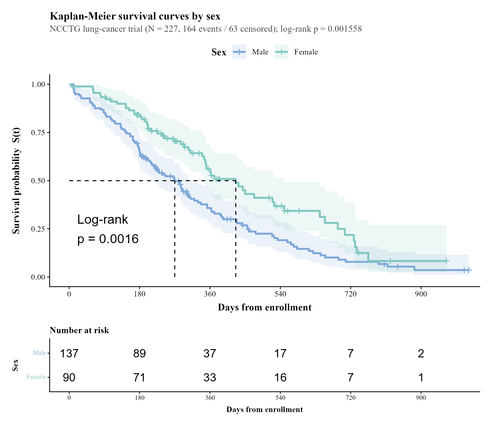
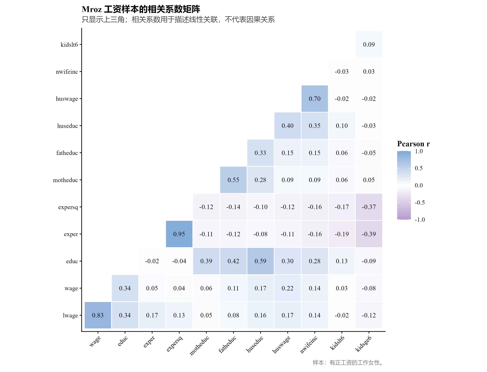
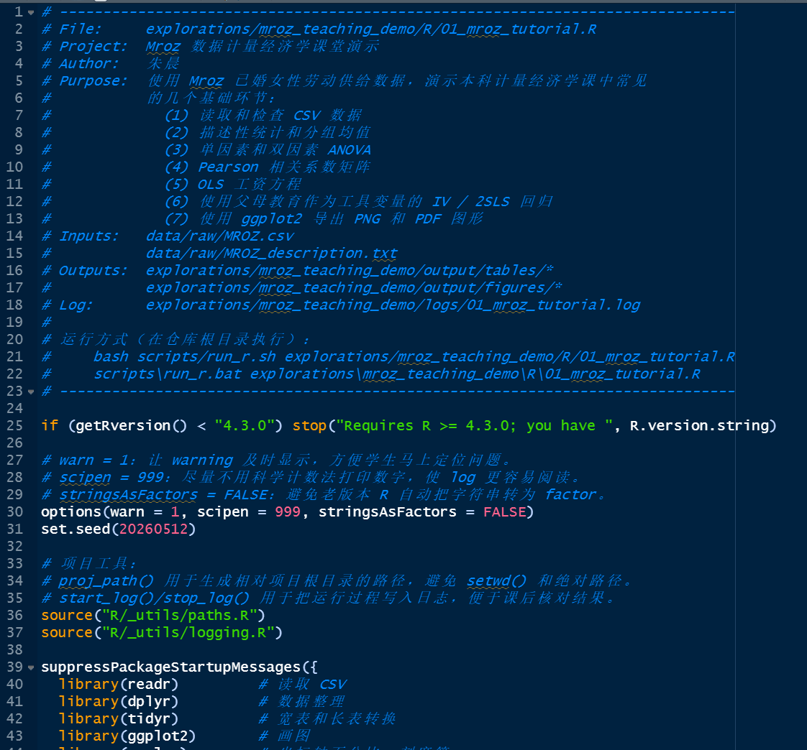
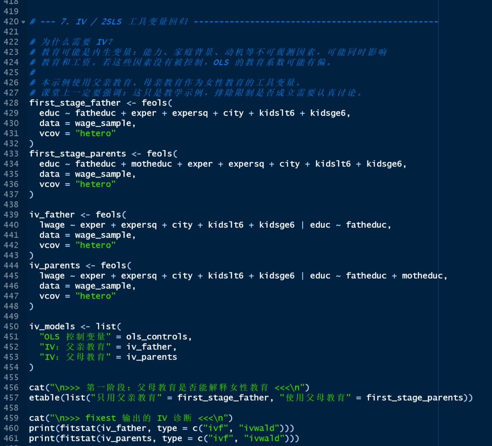

# 面向实证研究人员的 R 可复现 Codex 工作流 | Codex R for Empirical Research

**作者：** 朱 晨 | 遗传社科研究 Chen Zhu | China Agricultural University (CAU)

**最后更新：** 2026-05-13

这是一个面向**实证研究、方法教学和可复现数据分析**的 R + Codex 工作流模板。它最初从经济学和管理学实证研究场景出发，但并不只适用于经管专业。凡是需要处理结构化数据、构造变量、完成统计建模、生成表格图形、撰写可复现报告的研究与教学场景，都可以在这个框架上开展工作，例如：

- 经济学、管理学、社会科学中的回归、因果推断和政策评估；
- 医学、公共卫生和流行病学中的队列数据分析、风险因素研究、生存分析和临床/人群健康数据整理；
- 农业、营养、健康经济学和交叉学科研究中的调查数据、面板数据和多源数据分析；
- 本科和研究生课程中的 R 语言、统计学、计量经济学、流行病学方法和可复现科研训练。

本仓库的核心目标是让 Codex 把一个实证项目从原始数据、清洗、变量构造、模型估计，到表格、图形和 Quarto 报告，组织成一个**可运行、可检查、可复现、可教学**的研究流水线。

对于经管学生，这可以是一个计量经济学和实证论文训练模板。对于医学、公共卫生和流行病学学生，它也可以作为一个 R 数据分析项目模板，用来学习描述性统计、分组比较、回归、Cox 模型、Kaplan-Meier 曲线、队列数据整理和可复现报告写作。

本仓库采用 **Codex 优先、Claude Code 兼容** 的结构。Codex 进入项目后应优先读取 `AGENTS.md`。原有 `.claude/` 和 `CLAUDE.md` 保留用于兼容 Claude Code，也可作为更详细的规则参考。

生成的 R 代码及图表示例：

<p align="center">
  
  
</p>


<p align="center">
  
  
</p>

---

## 快速上手指南

> 在开始之前：建议已安装 Codex、R 4.3+、Python 3 或 Miniconda、Git。推荐安装 Quarto。

### Step 1. Fork & Clone

```bash
# 在 GitHub 上 Fork 本仓库，然后把 YOUR_USERNAME 替换成你的 GitHub 用户名
git clone https://github.com/YOUR_USERNAME/codex-r-for-economists.git my-codex-r-workflow
cd my-codex-r-workflow
```

也可以下载 zip 文件后本地解压，但这样无法进行版本控制，不推荐作为正式研究项目使用。

### Step 2. 启动 Codex

```bash
# 确保已进入本地仓库目录，例如 C:\my-codex-r-workflow
codex
```

把准备分析的数据文件放入 `data/raw/`。然后根据自己的需求修改下面的 Prompt，并复制给 Codex：

### A. 探索性分析（不指定明确因变量和自变量时）：

> 我把数据 **[Data NAME.csv]** 和数据说明放到 `data/raw/` 里了。请阅读 `AGENTS.md` 等配置文件，根据规则帮我用 R 进行分析。请先检查数据结构和变量含义，再生成一个可复现的 R script，完成 **[描述性统计、分组比较、直方图、箱线图、相关系数矩阵、OLS/Logit/Cox/IV/DID 等分析]**。代码要使用项目相对路径，图表保存在 `output/` 或对应 `explorations/<name>/output/` 中，每次运行都要保存 log 文件用于核对。所有代码请加上清楚的中文注释，方便学生理解和复现。

### B. 正式分析（明确指定因变量和自变量时）：

> 我把数据 [Data NAME.csv] 和数据说明放到 `data/raw/` 里了。请阅读 `AGENTS.md` 等配置文件，根据本项目规则帮我用 R 完成一套可复现分析。本次分析的研究问题是：**[在这里写研究问题，例如：教育年限是否影响个人收入？糖摄入是否与癌症风险相关？某项政策是否改善了健康结果？]**。请使用以下变量：**[在这里写明具体要用的自变量、因变量、控制变量、工具变量等]**。进行 **[在这里写明采用的分析方法，如DID、生存分析、事件研究法等]** 分析。代码要使用项目相对路径，图表保存在 `output/` 或对应 `explorations/<name>/output/` 中，每次运行都要保存 log 文件用于核对。所有代码请加上清楚的中文注释，方便我理解和复现。

如果 Codex 中途找不到 R 或 Python，请按 Esc 暂停，并告诉 Codex 你的 R 和 Python 版本及安装位置。

---

## 这个仓库做什么

本仓库提供一套 R 实证研究流水线：

- 原始数据放在 `data/raw/`，默认不提交。
- 中间数据放在 `data/derived/`，默认不提交。
- 主流水线入口是 `R/00_main.R`。
- 正式 R script 按阶段放入 `R/01_clean/` 到 `R/04_output/`。
- 表格输出到 `output/tables/`。
- 图形输出到 `output/figures/`。
- 报告使用 `reports/analysis_report.qmd`，通过 Quarto 渲染。
- 探索性分析、教学示例和一次性实验放在 `explorations/`。
- 可复用函数放在 `R/_utils/`，未来可逐步整理为 R package。

`explorations/` 下的每个子目录都应尽量自包含，通常包括自己的 `README.md`、`R/`、`logs/` 和 `output/`。这样一个教学示例、临时分析或方法演示可以独立运行，不会污染正式流水线。

---

## 适合哪些人使用

这个仓库适合三类使用者。

**第一类是实证研究者。** 如果你的论文需要处理调查数据、行政数据、面板数据、队列数据或公开数据库，这个模板可以帮助你把数据处理、模型估计、表格图形和报告写作连接起来。

**第二类是方法课教师和学生。** 如果你在教或学 R、统计学、计量经济学、流行病学、公共卫生数据分析、生物统计或健康经济学，可以把每一个 `explorations/` 子目录当作一个可运行的课堂案例。

**第三类是想用 Codex 维护研究代码的人。** 本仓库把 Codex 的任务边界写入 `AGENTS.md`：它可以帮助写代码、检查路径、改进图表和生成报告，但不能在没有日志和输出表格的情况下编造研究结果。

---

## 支持的分析类型

本仓库默认支持常见 R 实证分析流程，包括：

- 数据读取、清洗和变量构造；
- 描述性统计、分组均值和基线特征表；
- 直方图、箱线图、散点图、相关系数热力图等 `ggplot2` 图形；
- t 检验、卡方检验、ANOVA / 方差分析；
- OLS、Logit/Probit、Poisson、固定效应回归、稳健标准误；
- IV / 2SLS 工具变量回归；
- DID、staggered DID、事件研究和 DDML 等因果推断示例；
- Kaplan-Meier 曲线、Cox proportional hazards model 等生存分析示例；
- `modelsummary` 导出 `.csv`、`.tex`、`.html` 表格；
- `ggsave()` 同时导出 `.png` 和 `.pdf` 图形；
- Quarto 报告的自动渲染。

正式分析通常放在 `R/03_analysis/`，并通过 `R/00_main.R` 串联到完整流水线；尚在测试、教学或复现阶段的方法先放在 `explorations/`。

---

## 从工作流到 R package

这个仓库不仅可以作为项目模板，也可以逐步发展为一个 R package。

目前仓库已经包含 `DESCRIPTION` 文件和 `R/` 目录，这意味着它已经具备 R package 的雏形。未来可以把 `R/_utils/` 中稳定、通用、反复使用的函数整理成包函数，把一次性脚本继续保留在 `R/01_clean/`、`R/02_construct/`、`R/03_analysis/` 和 `R/04_output/` 中。

一个合理的发展方向是：先不要急着把整个仓库都“打包”，而是把最有复用价值的部分抽出来。例如：

```r
# 路径管理
proj_path("data", "raw", "my_data.csv")

# 日志管理
start_log("03_main_regression")
on.exit(stop_log(), add = TRUE)

# 发表级图形主题
theme_journal()

# 同时保存 png 和 pdf
save_plot_both(
  plot = p,
  filename = "baseline_balance",
  dir = proj_path("output", "figures")
)

# 自动导出模型表
export_model_table(
  models = list("OLS" = m1, "FE" = m2),
  file = proj_path("output", "tables", "main_results.csv")
)
```

未来如果正式转为 R package，可以考虑加入这些函数模块：

| 模块 | 可能函数 | 用途 |
|---|---|---|
| 路径管理 | `proj_path()`、`ensure_dir()` | 避免绝对路径和 `setwd()` |
| 日志系统 | `start_log()`、`stop_log()` | 保存可验证运行记录 |
| 数据检查 | `check_missing()`、`audit_data()` | 快速生成数据质量报告 |
| 表格输出 | `export_model_table()`、`make_balance_table()` | 统一导出论文表格 |
| 图形主题 | `theme_journal()`、`save_plot_both()` | 统一期刊风格图形 |
| Codex 辅助 | `write_run_manifest()`、`check_outputs()` | 让 AI 修改后的结果更容易核验 |

这样，这个项目可以同时保留两种身份：一方面是“可直接 fork 的研究项目模板”，另一方面是“可逐步沉淀为 R package 的工具集合”。

如果未来要更像正式 R package，建议逐步补充：

- `NAMESPACE`
- `man/` 文档
- `tests/testthat/`
- `vignettes/`
- `pkgdown` 网站
- GitHub Actions 自动检查
- `renv.lock` 或其他依赖锁定机制

---

## Codex 使用说明

Codex 的主说明文件是：

```text
AGENTS.md
```

Codex 后续维护本仓库时应遵守这些规则：

- 新增或修改 R script 时，注释默认使用中文，尤其是教学示例。
- 所有数值结论必须能追溯到 `logs/*.log`、`explorations/*/logs/*.log` 或 `output/tables/*`。
- 没有日志或输出表格支撑时，不编造回归结果、标准误、样本量或描述统计。
- 不提交 `data/raw/`、`data/derived/`、日志文件或原始数据格式文件。
- 维护 `.gitignore` 和 `scripts/check_data_safety.py` 的数据保护规则，不随意放松。
- 每个 exploration 的 R script 必须把主日志写入自己的 `explorations/<name>/logs/`。
- 对 `.R`、`.qmd`、用户可见 Python 脚本做实质修改后，尽量运行质量检查。
- 面对医学、流行病学或公共卫生数据时，不输出个人层面的敏感信息；报告中只使用汇总结果、模型结果和匿名化图表。

Claude Code 兼容文件仍然存在：

- `CLAUDE.md`：Claude Code 的项目记忆入口。
- `.claude/`：Claude Code 的 agents、skills、rules、hooks。

这些文件不影响 Codex 使用。除非确定以后完全不使用 Claude Code，否则建议保留。

---

## 四个核心保证

| 保证 | 执行方式 |
|---|---|
| 可复现 | R 版本和包由项目配置固定；脚本使用相对路径；随机过程设置统一种子；流水线从 `R/00_main.R` 启动 |
| 日志验证 | 数值结论必须来自 R log 或输出表格；无日志则不报告结果 |
| 数据保护 | `.gitignore` 和 `check_data_safety.py` 阻止 raw/derived 数据、日志、CSV、JSON 和常见数据格式误提交 |
| 可发表 / 可教学输出 | 表格通过 `modelsummary` 等工具输出；图形通过 `ggplot2` / `ggsave()` 同时输出 `.pdf` 和 `.png` |

---

## 目录结构

```text
.
├── AGENTS.md                       # Codex 主说明文件
├── CLAUDE.md                       # Claude Code 兼容说明
├── MEMORY.md                       # 旧 Claude 工作流的长期记忆
├── DESCRIPTION                     # R 项目 / R package 元数据
├── .Rprofile                       # R 启动配置
├── .claude/                        # Claude Code agents、skills、rules、hooks
├── R/
│   ├── 00_main.R                   # 主流水线入口
│   ├── 01_clean/                   # 原始数据清洗
│   ├── 02_construct/               # 变量构造和样本构造
│   ├── 03_analysis/                # 回归、IV、DID、事件研究、生存分析等
│   ├── 04_output/                  # 表格和图形汇总输出
│   └── _utils/                     # 可复用 R 工具代码，未来可整理为 package 函数
├── data/
│   ├── raw/                        # 原始数据，不提交
│   ├── derived/                    # 中间数据，不提交
│   └── README.md                   # 数据说明
├── logs/                           # 根目录 wrapper / pipeline 日志，不提交
├── output/
│   ├── tables/                     # 正式结果表格，可提交
│   └── figures/                    # 正式结果图形，可提交
├── reports/                        # Quarto 报告
├── scripts/                        # 运行、复现和质量检查脚本
├── quality_reports/                # 计划、会话记录、合并报告
├── explorations/                   # 探索性分析、方法演示和教学示例
└── templates/                      # 可复用模板
```

---

## 常用命令

运行完整流水线：

```bash
bash scripts/run_pipeline.sh
```

运行单个 R script：

```bash
bash scripts/run_r.sh R/03_analysis/main_regression.R
```

Windows PowerShell 下运行单个 R script：

```powershell
scripts\run_r.bat R\03_analysis\main_regression.R
```

渲染 Quarto 报告：

```bash
quarto render reports/analysis_report.qmd
```

提交前检查数据安全：

```bash
python scripts/check_data_safety.py --staged $(git diff --cached --name-only)
python scripts/check_data_safety.py --self-test
```

给 R script、报告或 Python 脚本打质量分：

```bash
python scripts/quality_score.py R/path/file.R
python scripts/quality_score.py reports/analysis_report.qmd
python scripts/quality_score.py scripts/check_data_safety.py
```

如果未来作为 R package 开发，可以逐步加入：

```r
devtools::document()
devtools::check()
testthat::test_dir("tests/testthat")
```

---

## R 编码约定

正式 R script 应满足以下要求：

- 文件开头写明最低 R 版本，例如 `if (getRversion() < "4.3.0") stop(...)`。
- 使用 `options(warn = 1, scipen = 999, stringsAsFactors = FALSE)`。
- 使用项目相对路径，不写死本机绝对路径，不使用 `setwd()`。
- 使用 `proj_path()` 或 `here::here()` 组织路径。
- 每个可独立运行的 R script 都应开启日志。
- 涉及随机过程时，在脚本开头设置一次随机种子。
- 回归结果如果要进入表格，应保存为命名 list，便于 `modelsummary()` 输出。
- 图形使用 `ggplot2`，并通过 `ggsave()` 同时导出 `.pdf` 和 `.png`。
- 图形默认使用 `R/_utils/theme_journal.R` 中的 `theme_journal()` 和 `pal_journal`。
- 新增或修改的 R 注释默认使用中文，尤其是面向课堂的 `explorations/` 示例。
- 医学、流行病学和公共卫生分析中，不在日志、报告或图形中暴露个人身份信息或行级敏感数据。

推荐日志模板：

```r
source("R/_utils/paths.R")
source("R/_utils/logging.R")

start_log("03_main_regression")
on.exit(stop_log(), add = TRUE)
```

`explorations/<name>/R/` 下的脚本必须把主日志写入本 exploration 自己的 `logs/`：

```r
demo_dir <- proj_path("explorations", "<name>")
log_dir <- file.path(demo_dir, "logs")
dir.create(log_dir, recursive = TRUE, showWarnings = FALSE)

start_log("<script_name>", dir = log_dir)
on.exit(stop_log(), add = TRUE)
```

---

## 数据保护规则

默认不得提交：

- `data/raw/**`
- `data/derived/**`
- `logs/**`
- `explorations/*/logs/**`
- `*.log`
- `*.dta`
- `*.sav`
- `*.por`
- `*.parquet`
- `*.feather`
- `*.rds`
- `*.RData`
- `*.csv`
- `*.json`
- `*.xls`
- `*.xlsx`

允许提交的典型文件：

- `data/README.md`
- `data/raw/.gitkeep`
- `data/derived/.gitkeep`
- `output/tables/*.csv`
- `output/tables/*.tex`
- `explorations/*/output/tables/*.csv`
- `output/figures/*.pdf`
- `output/figures/*.png`
- `explorations/*/output/figures/*.pdf`
- `explorations/*/output/figures/*.png`

如果确实需要提交某个聚合数据或示例数据，必须明确说明原因，并通过 `.gitignore` 和 `scripts/check_data_safety.py` 做最小范围白名单。

---

## 日志验证规则

所有研究结果相关的数值结论都必须有来源。

可以作为来源的文件包括：

- `logs/*.log`
- `explorations/*/logs/*.log`
- `output/tables/*.csv`
- `output/tables/*.tex`
- `explorations/*/output/tables/*.csv`
- `explorations/*/output/tables/*.tex`

不能作为最终依据的内容包括：

- 记忆中的数字；
- 未保存的交互式 R 输出；
- 截图中的结果；
- 没有日志支撑的手工推算；
- Codex 或其他 AI 直接生成、但没有经过本地脚本运行验证的结果。

如果没有日志或输出表格，应先运行相关 R script，而不是直接报告结果。

---

## 探索性分析

`explorations/` 是沙盒目录，适合放：

- 教学示例；
- 临时探索；
- 复现练习；
- 尚未进入正式流水线的一次性脚本；
- 医学、流行病学、公共卫生、健康经济学等领域的方法演示；
- 未来准备整理为 R package 函数的原型代码。

每个探索性子目录应尽量自包含，通常包括自己的：

- `README.md`
- `R/`
- `logs/`
- `output/tables/`
- `output/figures/`

当某个探索性分析成熟后，可以迁移到正式流水线：把 R script 移入 `R/01_clean/` 到 `R/04_output/`，并接入 `R/00_main.R`。如果其中的函数具有通用性，也可以进一步整理到 `R/_utils/`，为未来 R package 化做准备。

---

## 当前示例

当前仓库包含若干探索性教学和方法示例：

- `explorations/mroz_teaching_demo/`：基于 Mroz 已婚女性劳动供给数据的教学示例，包含描述统计、ANOVA、相关矩阵、OLS、IV 和 ggplot2 图形。
- `explorations/educwages_r_tutorial/`：教育回报教学示例，包含描述统计、图形、OLS、IV 和 ANOVA。
- `explorations/hsb2_teaching_demo/`：基于 UCLA HSB2 数据的教学示例，包含描述统计、直方图和 OLS 回归。
- `explorations/staggered_did_demo/`：staggered DID 教学示例，比较 TWFE 与异质性稳健估计量。
- `explorations/ddml_demo/`：double/debiased machine learning 教学示例。
- `explorations/survival_demo/`：Kaplan-Meier 和 Cox proportional hazards 教学示例。

这些示例用于展示工作流，不代表正式研究项目。

---

## 本地环境

常用工具：

| 工具 | 用途 |
|---|---|
| Codex | 代码与文档维护、R 工作流协助 |
| Claude Code | 可选兼容工具 |
| R 4.3+ | 运行 R script |
| Python 3 / Miniconda | 数据安全检查和质量评分 |
| Quarto | 渲染报告 |
| Git / GitHub CLI | 版本控制和协作 |

如果 `Rscript` 不在 `PATH` 中，需要先加入 R 的 `bin` 目录。例如 Windows PowerShell：

```powershell
$env:PATH = "C:\Program Files\R\R-4.5.0\bin;$env:PATH"
scripts\run_r.bat R\00_main.R
```

Windows Git Bash：

```bash
export PATH="/c/Program Files/R/R-4.5.0/bin:$PATH"
bash scripts/run_pipeline.sh
```

---

## 致谢

本仓库受到以下资源启发：

- `claude-code-my-workflow`：Pedro H. C. Sant'Anna 的 Claude Code / 实证研究工作流。
- `claude-code-r-skills`：Alistair Bailey 的 R 技能文件集合。
- `Modern R Development Guide`：现代 R 项目开发和 tidyverse 习惯。

---

## 许可证

MIT.
